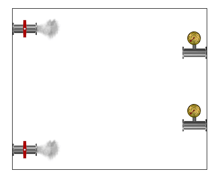

   
 
##@ The objective of the game is to connect your pipe to the end pipe and open the valve. 
Each player will take turns consisting of one of the following options:
1. Place a Tile
2. Rotate a Tile
3. Discard a Tile
4. Open Valve
5. Give Up

**Place Tile:** Hovering over the grid shows green patches where pipes can be placed, selecting a pipe and placing it will move it to the grid. This ends your turn.

**Rotate Tile:** Selecting a pipe from the available options and pressing the Rotate button will rotate the tile clockwise to get it into any position you'd like. This does not end your turn.

**Discard Tile:** Selecting a pipe from the available options and selecting Discard will remove the pipe from the available options and end your turn.

**Open Valve:** Opening the valve will check your pipes to see if it is connected to the end pipe and without leaks. If you have done so, you win the game. Otherwise, you lose.

**Give Up:** You lose.
